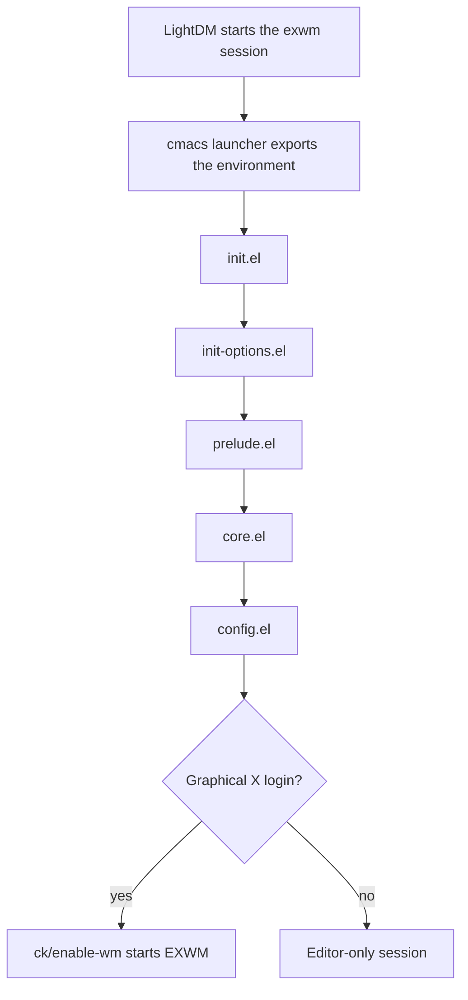
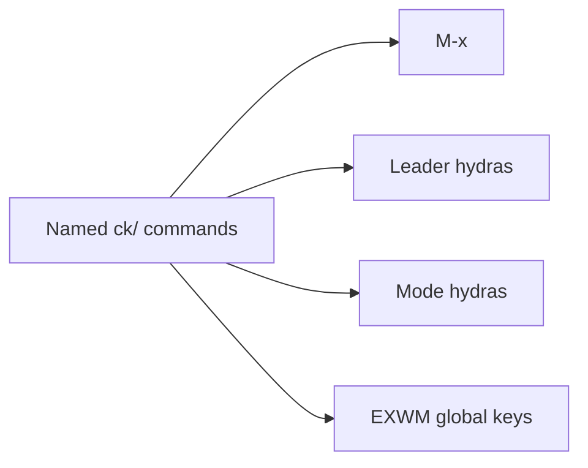

# cmacs

**cmacs** is my personal Emacs configuration and X window manager. Emacs runs
as the desktop session through
[EXWM](https://github.com/emacs-exwm/exwm), rather than inside another desktop
environment. Nix builds the Emacs binary, its packages, and the launcher.

- **System:** one NixOS host named `poseidon`.
- **Goal:** make named Emacs commands the control surface for editing and the
  desktop.
- **Constraint:** host-specific behavior is intentional. Portability is not a
  design goal.

## Philosophy

Emacs is a manager and runner of text. Commands matter more than hotkeys. A
keybinding should expose a useful function, not hide behavior inside a gesture.

The configuration follows a few rules:

- **Functions first:** write a named command, then bind it where useful.
- **Text as interface:** buffers remain the main surface for code, output,
  search, logs, and structured data.
- **Discoverability:** `M-x`, help commands, Hydra menus, and symbol navigation
  should make the system inspectable from inside itself.
- **Immediate feedback:** Flycheck, completion, live theme reload, and REPL
  workflows shorten the edit and verify loop.
- **One machine:** concrete host behavior beats abstraction for hypothetical
  systems.

Useful Emacs vocabulary:

| Concept | Why it matters |
|---------|----------------|
| Major mode | Defines the main behavior for a buffer |
| Minor mode | Adds an independent behavior to a buffer |
| `M-x` | Runs any interactive command by name |
| `describe-*` | Explains commands, variables, modes, faces, and keys |
| `*Messages*` | Shows errors, warnings, and ordinary diagnostic output |
| Info | Provides the Emacs manuals inside Emacs |

`M-x info-emacs-manual` opens the GNU Emacs manual. The
[command-log-mode](https://github.com/lewang/command-log-mode) package records
interactive commands, which is useful when turning a repeated workflow into a
function.

The main interaction stack is:

- [Evil](https://github.com/emacs-evil/evil) for modal editing.
- [Org](https://orgmode.org/manual/) for notes, tasks, and structured text.
- [Flycheck](https://github.com/flycheck/flycheck) for diagnostics.
- Vertico, Consult, Orderless, Marginalia, and Embark for completion and
  search.
- General and Hydra for command discovery and keybinding menus.

## Runtime architecture



The entire configuration loads before EXWM starts. `init.el` activates the
window manager only when Emacs began in a graphical X login. The same config
can therefore run as an editor on a plain terminal without trying to become
the window manager.

The activation point is `ck/enable-wm` in `core/desktop.el`. Loading a module
must never activate EXWM as a side effect.

## Built and launched by Nix

Nix owns the executable environment. Emacs does not install packages at
runtime.

| Path | Responsibility |
|------|----------------|
| `../nix-conf/modules/cmacs.nix` | Installs cmacs and imports EXWM setup |
| `../nix-conf/modules/exwm.nix` | Registers the display-manager session |
| `../nix-conf/derivations/cmacs/default.nix` | Builds the launcher |
| `../nix-conf/packages/emacs.nix` | Defines the Emacs package set |

The launcher exports the load path and runs this configuration explicitly:

```text
emacs --debug-init --no-site-file --no-site-lisp \
  --no-init-file --load emacs-conf/init.el
```

This source tree is not `~/.emacs.d`. Emacs still uses `~/.emacs.d` for some
ordinary state, including `custom.el`, but package management and config
loading come from Nix and this repository.

After a Nix rebuild, run `M-x ck/latest-loadpath` to refresh the running Emacs
load path without restarting the desktop.

### Environment contract

`core/env.el` exposes launcher and user environment values as Emacs options:

| Environment | Emacs option | Purpose |
|-------------|--------------|---------|
| `CONFIG_PATH` | `cmacs-config-path` | This configuration directory |
| `SHAREPATH` | `cmacs-share-path` | Books, notes, summaries, and sounds |
| `USER_EMAIL` | `user-email` | Personal email identity |
| `USER_GPG_ID` | `user-gpg-id` | GPG identity |
| `HOME` | `user-home-path` | Home directory |

## Configuration architecture

| Layer | Role | Loading rule |
|-------|------|--------------|
| `init` | Orders boot and activates the WM | Direct calls and `require` |
| `core/` | Keeps the machine operable | Loaded by `core.el` |
| `config/` | Normal editor and desktop features | Loaded by `config.el` |
| `lib/` | Reusable operations without wiring | Required by consumers |
| Nix | Packages, binaries, services, environment | Built before login |

### Core

`core/` is the degraded-mode survival kit. It owns the command surface, EXWM
machinery, environment options, and basic editing behavior. A failure later in
`config/` should still leave enough Emacs working to inspect and repair the
system.

### Config

`config/` contains normal application behavior: desktop commands, language
support, search, services, viewers, themes, games, and task management.

### Library

`lib/` holds reusable operations with no hooks, keybindings, or boot wiring.
Consumers load library features directly with `require`.

This distinction is deliberate:

- `m-require` joins application modules to an aggregator.
- `require` pulls a reusable library operation on demand.

## Module system

Features follow their logical path:

- `core/desktop.el` provides `core/desktop`.
- `config/desktop/windows.el` provides `config/desktop/windows`.
- `lib/shell.el` provides `lib/shell`.

An application aggregator loads sibling modules with `m-require`:

```elisp
(m-require config/desktop/commands
  system
  nix
  launchers)
```

A consumer loads a library directly:

```elisp
(require 'lib/shell)
```

Package activation is intentionally restricted. `init.el` initializes only
`bind-key` and `use-package` through `package.el`; package contents come from
the Nix load path. A deferred `use-package` form therefore needs an explicit
entry command, mode, hook, or binding that can load it.

## Repository map

### Boot and foundations

| Path | Owns |
|------|------|
| `init.el` | Boot order, GC policy installation, EXWM gate |
| `init-options.el` | Early UI, scrolling, backups, and custom-file |
| `prelude.el` | Shared libraries, macros, and `m-require` |
| `core.el` | Core aggregator |
| `config.el` | Application aggregator |
| `core/definers.el` | Evil, General, and Hydra macro foundations |
| `core/bindings.el` | Global leader and shared Hydra menus |
| `core/desktop.el` | EXWM startup, workspaces, and global X keys |
| `core/env.el` | The `cmacs` customization group and environment |
| `core/text.el` | Evil and basic editing behavior |

### Reusable operations

| Path | Owns |
|------|------|
| `lib/utils.el` | File, buffer, completion, and window operations |
| `lib/shell.el` | Process launch and shell-command construction |
| `lib/sound.el` | PipeWire sink operations |

### Configured features

| Path | Owns |
|------|------|
| `config/desktop/` | Host commands, launchers, links, and window policy |
| `config/dev/` | Project, test, Git, diff, and process workflows |
| `config/langs/` | Language packages, commands, REPLs, and keys |
| `config/modes/` | Local presentation and reading modes |
| `config/services/` | ECA, LSP, server, media, and network integrations |
| `config/viewers/` | Browser, document, journal, and media viewers |
| `config/games/` | Chess and Warcraft helpers |
| `config/theme/` | EDN theme data, compiler, and live editor |
| `config/gtd.el` | Org-roam task management and Pomidor |
| `config/performance.el` | Interactive garbage-collection policy |
| `config/search.el` | Completion, search, and project navigation |
| `config/navigation.el` | Buffer movement and window spawning |

### Development tools

The files under `tools/` are development checks. They are not loaded by the
running configuration.

| Tool | Purpose |
|------|---------|
| `tools/fc-check.sh` | Byte-compile files in the cmacs environment |
| `tools/cmacs-deps.el` | Inspect dependencies and classify modules |
| `tools/lib-guard.sh` | Protect the library and application boundary |
| `tools/wm-free-check.sh` | Prove the tree loads without activating EXWM |

## Command surfaces



Named functions are the source of truth. Bindings are discovery surfaces.

- `M-x` reaches every interactive command.
- `SPC` opens `hydra-leader` in Evil normal state.
- `s-SPC` opens the same leader globally under EXWM.
- Mode maps remap `empty-mode-leader` to their own Hydra.
- `core/desktop.el` owns keys that must work inside X applications.

Super and Meta are intentionally swapped:

```elisp
(setq x-super-keysym 'meta
      x-meta-keysym 'super)
```

Read `s-` and `M-` bindings using cmacs semantics, rather than stock Emacs
keyboard assumptions.

## Major systems

### Window management

The layout is a row of full-height vertical bands. A band may contain a top
and bottom pane. Spawn and resize commands operate on the band as a unit, so a
new right-hand window does not split only half of a stacked column.

EXWM behavior and global keys live in `core/desktop.el`. Window policy and
runtime patches live in `config/desktop/windows.el`.

### Search and completion

Vertico, Consult, Orderless, Marginalia, and Embark share the standard
`completing-read` interface. Pickers therefore use one completion stack. Ivy
is no longer part of the configuration.

### Themes

Themes are authored as semantic EDN in `config/theme/`. The active theme
combines palette, role, and structural data. `config/theme/editor.el` compiles
that data into a Doom theme and can apply changes live.

Run `M-x ck/doom-theme-edit` to edit the theme with live reload.

### ECA

`config/services/eca.el` aggregates focused modules under
`config/services/eca/`. Navigation, tabs, prompt composition, rendering,
folding, and per-chat isolation stay in separate files.

### Clojure

`config/langs/clj/` is the richest language area. Package setup remains in
`config/langs/clj.el`; evaluation, jack-in, Systemic control, and keybindings
live in focused sibling modules.

## Where changes belong

| Change | Put it here |
|--------|-------------|
| Essential WM survival behavior | `core/` |
| EXWM activation or global X keys | `core/desktop.el` |
| Desktop window policy | `config/desktop/windows.el` |
| Host command or hardware recovery | `config/desktop/commands/system.el` |
| Application launcher | `config/desktop/commands/launchers.el` |
| Reusable process operation | `lib/shell.el` |
| Cross-feature pure helper | `lib/utils.el` |
| Language behavior | `config/langs/<language>/` |
| Background integration | `config/services/` |
| Theme data | `config/theme/*.edn` |
| Package or executable dependency | `../nix-conf/` |

When a configured feature contains a reusable operation, move the operation to
`lib/` and leave its hooks, packages, and keybindings in `config/`.

## Development workflow

### Find the owning code

1. Use `M-x find-function` for a known command.
2. Read the feature's final `provide` form.
3. Check the nearest aggregator to see how it loads.
4. Put the change in the narrowest module that owns the behavior.

### Load a change live

The window-manager Emacs runs a server. A safe file can be reloaded with:

```text
emacsclient --eval \
  '(load-file "/absolute/path/to/file.el")'
```

Files with top-level hooks, advice, or list mutation need targeted reloads.
Repeated `load-file` calls do not undo old global registrations. The
project-local `patch-live-cmacs` skill documents the safe procedure when the
agent docs are present.

### Verify before finishing

- Run `tools/fc-check.sh` on changed Emacs Lisp.
- Run `tools/wm-free-check.sh` after load-order or boundary changes.
- Exercise the real interactive path in the running Emacs.
- Read back state after the command completes.

## Operations and recovery

| Command | Use |
|---------|-----|
| `M-x ck/latest-loadpath` | Refresh Nix-built package paths after a rebuild |
| `M-x ck/fix-monitor-blackouts` | Reset PG32UCDP wake blackouts via 120 Hz |
| `M-x ck/lock-screen` | Lock through the logind and xss-lock stack |
| `M-x ck/restart-display-manager` | Restart the graphical session |

`ck/fix-monitor-blackouts` switches `DP-0` to 4K at 119.88 Hz, waits one
second for the monitor to lock, and restores 240.02 Hz. The wait is
asynchronous, so Emacs remains responsive during the transition.

## External state

Shared data lives under `$SHAREPATH`, outside this repository. It includes
Org-roam files, books, summaries, and sounds.

Some commands also use:

- Personal scripts under `~/.scripts/`.
- `../manage_browser_links.clj` through Babashka.
- NixOS services declared under `../nix-conf/modules/`.

## Invariants

- Only `ck/enable-wm` may activate EXWM.
- `core/` must remain useful if later configuration fails.
- `lib/` must not acquire hooks, keybindings, or WM dependencies.
- Dependencies come from Nix, not runtime package installation.
- Aggregators use `m-require`; library consumers use `require`.
- Named functions own behavior. Keybindings only expose it.
- Live changes must be verified in the running Emacs.

When `.eca/docs/` is available, its `README.md` and
`reference/cmacs-module-map.md` provide the deeper agent-maintained state and
routing references.
